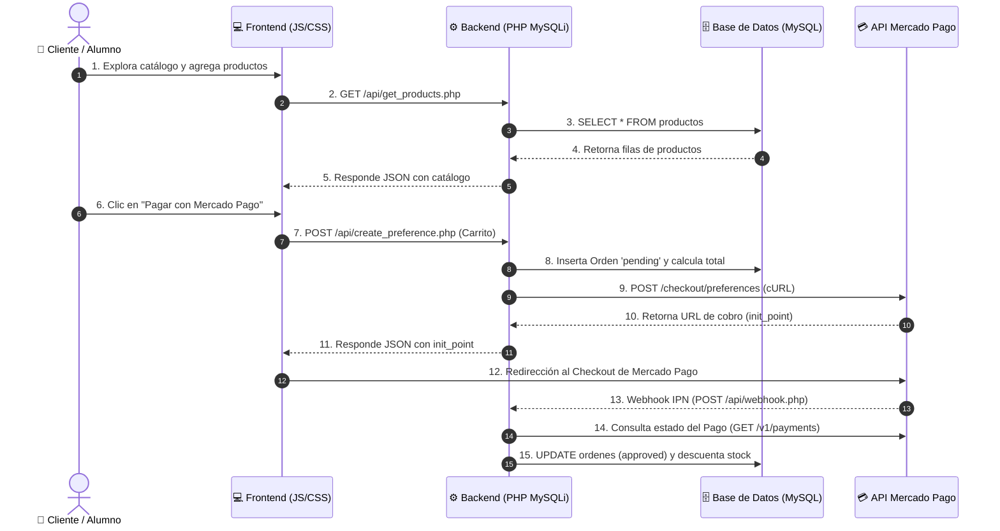

# 📚 Guía Didáctica: Arquitectura y Funcionamiento del Kiosco Online

Esta guía está diseñada como material educativo para estudiantes de desarrollo web full stack. Explica de forma conceptual, técnica y paso a paso cómo interactúan los componentes de una aplicación moderna: **Frontend (HTML/CSS/JS)**, **Backend (PHP MySQLi)**, **Base de Datos Relacional (MySQL)** y una **Pasarela de Pagos (Mercado Pago API)**.

---

## 1. Visión General de la Arquitectura

Una aplicación web **Full Stack** se divide en capas de responsabilidad:

---

## 2. Los 5 Módulos del Sistema Explicados

### Módulo 1: Base de Datos Relacional (MySQL)
La base de datos es la encargada de la **persistencia de datos**. Se compone de 4 tablas relacionadas:

1. **`productos`**: Almacena el inventario (`nombre`, `precio`, `categoria`, `stock`, `imagen_url`, `destacado`).
2. **`ordenes`**: Registra cada transacción (`external_reference`, `monto_total`, `estado`, `mp_payment_id`).
3. **`orden_items`**: Tabla de relación (1 a Muchos) que desglosa qué productos y cuántas unidades componen cada orden.
4. **`usuarios`**: Guarda las credenciales del personal administrador (`username`, `password_hash`).

> **Concepto para Alumnos (Integridad Referencial):**
> Usamos llaves foráneas (`FOREIGN KEY`) en `orden_items` con `ON DELETE CASCADE`. Si una orden se elimina, sus ítems asociados se eliminan automáticamente para evitar datos huérfanos.

---

### Módulo 2: Backend REST API con PHP y MySQLi (Orientado a Objetos)

El servidor actúa como puente seguro. No confiamos en los precios que envía el navegador del cliente; el backend siempre valida los datos en MySQL usando **MySQLi**.

- **Conexión Segura (MySQLi Singleton)** (`config/database.php`):
  Previene múltiples conexiones innecesarias a la base de datos utilizando el patrón de diseño **Singleton** (`new mysqli(...)`). Activa el reporte estricto de excepciones (`MYSQLI_REPORT_ERROR | MYSQLI_REPORT_STRICT`) y establece el juego de caracteres UTF-8 (`set_charset("utf8mb4")`).

- **Consultas Preparadas con `bind_param()`**:
  Para evitar ataques de **Inyección SQL**, se utiliza `$stmt = $db->prepare(...)` vinculando explícitamente los tipos de datos en `$stmt->bind_param("sdsi", ...)`:
  - `i`: Integer (Entero)
  - `d`: Double / Float (Decimales)
  - `s`: String (Cadenas de texto)
  - `b`: Blob (Binario)

- **Manejo de Transacciones Atómicas (ACID)**:
  Para operaciones complejas como el checkout o el webhook, se delimitan transacciones usando `$db->begin_transaction()`, `$db->commit()` y `$db->rollback()`, garantizando que si falla un paso, no se generen datos inconsistentes.

- **Variables de Entorno con Composer** (`.env` + `vlucas/phpdotenv`):
  Las credenciales sensibles (contraseñas de BD y Access Tokens de Mercado Pago) jamás se escriben en el código fuente, sino que se leen en tiempo de ejecución desde el archivo `.env`.

- **Seguridad en Autenticación** (`config/auth.php` y `api/admin/login.php`):
  Las contraseñas se encriptan con el algoritmo estándar **BCRYPT** (`password_hash()`) y se verifican con `password_verify()`. Al iniciar sesión se regenera el ID de sesión (`session_regenerate_id(true)`) para prevenir ataques de **Session Fixation**.

---

### Módulo 3: Pasarela de Pagos (Mercado Pago API)

Integrar cobros en línea consta de dos etapas clave:

1. **Creación de la Preferencia de Pago** (`api/create_preference.php`):
   - El servidor prepara la lista de ítems (`items`), la referencia de la orden (`external_reference`), las URLs de retorno (`back_urls`) y el punto de notificación (`notification_url`).
   - Se realiza una petición HTTP POST vía **cURL** a la API oficial de Mercado Pago (`https://api.mercadopago.com/checkout/preferences`).
   - Mercado Pago responde con una URL única (`init_point`) a la que se redirige al cliente.

2. **Receptor Webhook / IPN** (`api/webhook.php`):
   - **¿Por qué es necesario?** Un cliente podría cerrar la ventana del navegador antes de regresar al sitio. El Webhook es un mecanismo **Asíncrono (Servidor a Servidor)**.
   - Mercado Pago envía una notificación HTTP a nuestro servidor indicando que un pago cambió de estado.
   - Nuestro backend consulta a Mercado Pago el estado real del pago y, si es `approved`, actualiza la orden en MySQLi y descuenta el stock del inventario.

---

### Módulo 4: Frontend Reactivo en Tiempo Real (HTML5 / CSS3 / JS)

El frontend está desarrollado con tecnologías web estándar sin dependencias pesadas:

- **Diseño Responsive & Glassmorphism** (`public/css/styles.css`):
  Utiliza variables CSS nativas (`:root`), grillas adaptativas (`grid-template-columns: repeat(auto-fill, minmax(260px, 1fr))`) y efectos de desenfoque (`backdrop-filter`).
- **Carrito Reactivo con Patrón Observable** (`public/js/cart.js`):
  El carrito mantiene el estado en tiempo real. Cuando el usuario agrega o quita un producto, se notifica a los suscriptores (`Cart.subscribe()`), actualizando el contador del encabezado, el subtotal y sincronizando los datos en `localStorage`.

---

### Módulo 5: Panel de Administración (CRUD)

Ubicado en `admin/index.php`, permite gestionar el negocio mediante las 4 operaciones **CRUD**:
- **C**reate: Agregar nuevos productos al catálogo mediante el formulario modal.
- **R**ead: Visualizar métricas de ventas y consultar el catálogo o historial de órdenes.
- **U**pdate: Modificar precio, stock o estado destacado de un producto existente.
- **D**elete: Eliminar productos del inventario.

---

